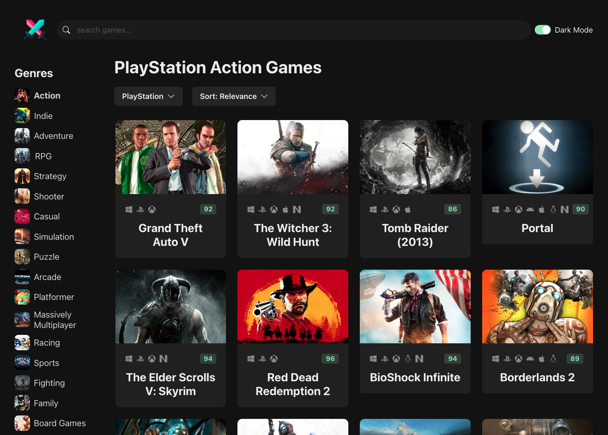

# Game Hub 🎮

A SPA built with React and TypeScript allowing you to view, search, filter and sort the latest games from the RAWG API. Built to learn front-end dev, and use as a sample app to practice CI/CD cloud deployments with DevOps pipelines

## Tech

- React: component-based JS library used to easily build dynamic reusable UIs
- TypeScript: an extension of JS used to add static typing to catch errors early and improve code quality
- Vite: Fast dev server and build tool for modern front-end apps
- RAWG API: Api used for fetching game data.

## Usage

```bash
# Clone project
git clone https://github.com/ck496/game-hub.git
cd game-hub

# Create a .env file and add your RAWG API key
echo "VITE_RAWG_API_KEY=your_api_key_here" > .env

# Install dependencies
npm install

# Start the development server
npm run dev
```

## Preview

<p align="center">
  
</p>
